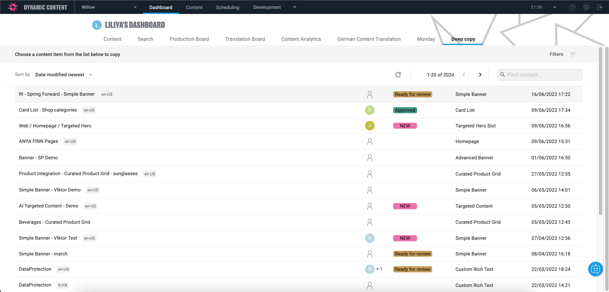
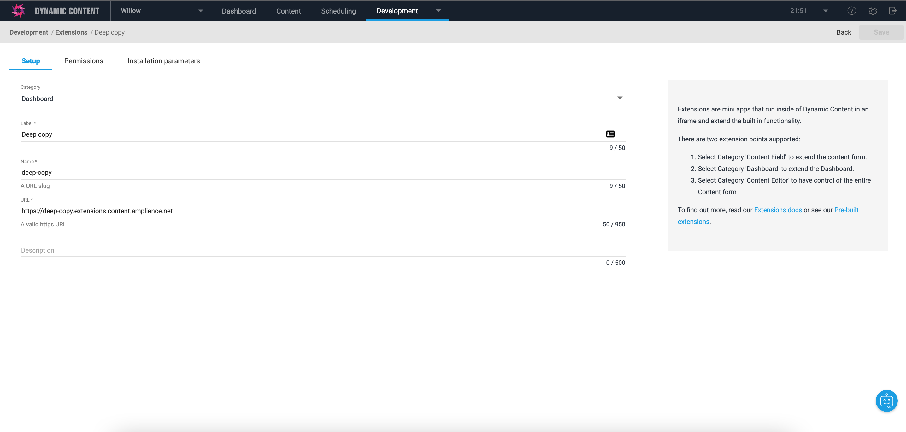
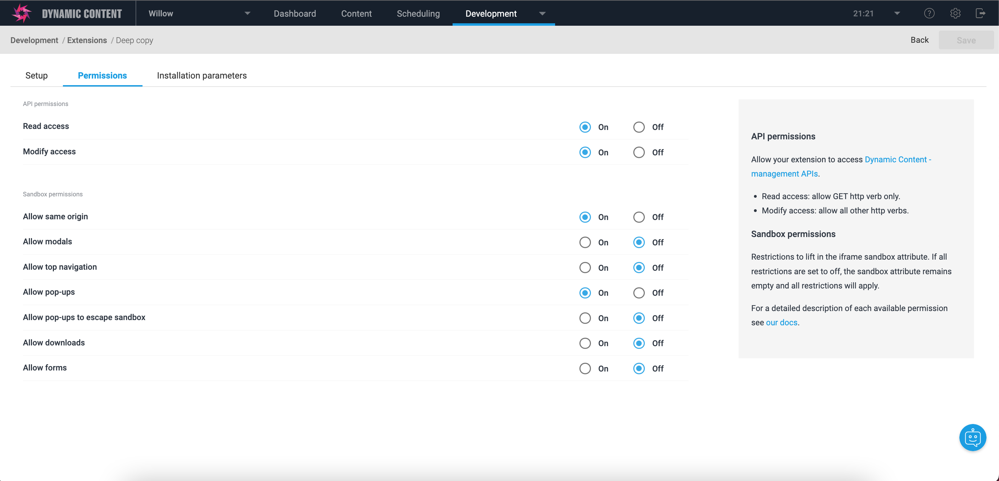
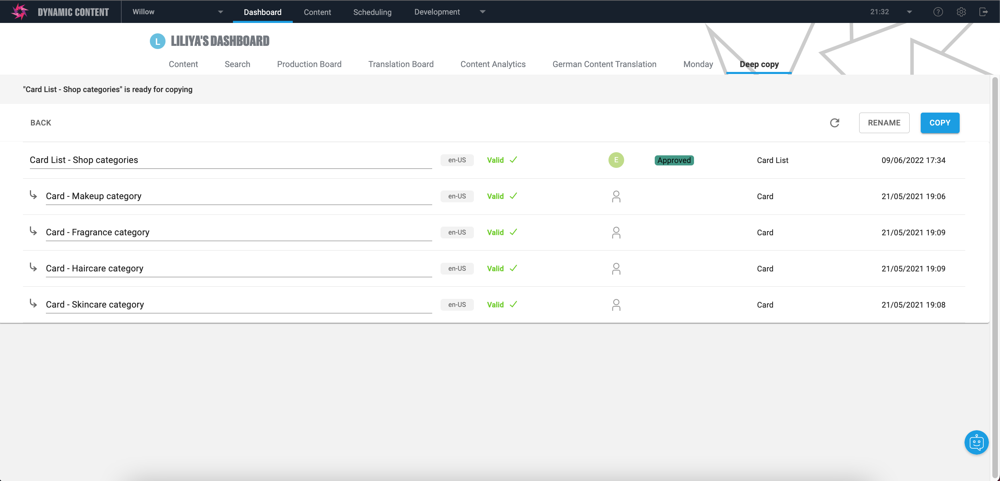
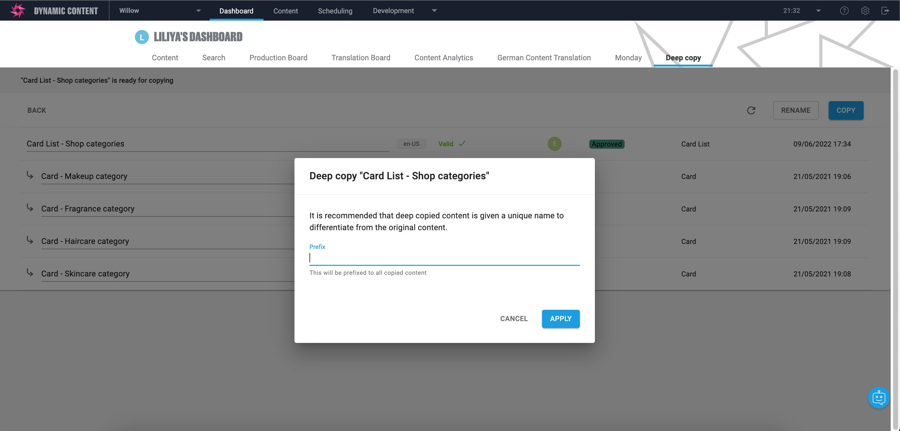

[](https://amplience.com/dynamic-content)



# Dynamic Content Deep Copy Extension

This extension allows users to make a deep copy of a content item with its dependencies. There is also the ability to rename future copies by adding a prefix or renaming each item individually. Users will see validation status on each dependency of the selected content item. Copying content is only possible when each dependency is valid, otherwise users need to fix invalid content first and press reload to validate it again.

## Register Extension

This extension needs to be [registered](https://amplience.com/docs/development/registeringextensions.html) against a Hub with in the Dynamic Content application (Developer -> Extensions), for it to load within that Hub.

### Setup



* Category: Dashboard
* Label: Deep Copy _(this will appear as the tab title in the Dashboard)_
* Name: deep-copy _(needs to be unique with the Hub)_
* URL: [https://deep-copy.extensions.content.amplience.net](https://deep-copy.extensions.content.amplience.net)
* Description: Deep Copy Extension _(can be left blank, if you wish)_

Note:
You can use our deployed version of this extension (builds from the "production" branch) -

[https://deep-copy.extensions.content.amplience.net](https://deep-copy.extensions.content.amplience.net)

_As this is an open source project you're welcome to host your own "fork" of this project. You can use any standard static hosting service (Netlify, Amplify, Vercel, etc.) if you wish._

#### Permissions



#### Installation parameters

The only one required installation parameter is `hub` id, user can find it in Hub settings -> Properties

```json
{
  "hub": "6b689b30cfd47e50614va258"
}
```

## Overview

Selected content item with its dependencies, validated successfully.



Rename functionality by adding prefix to future copies.



## Limitations

This version of Deep Copy Dashboard doesn't support validation and copy hierarchies. It will make a full copy of slot including all the dependencies.

## Build and run locally 

`npm install`
`npm run start`

Runs the app in the development mode over https.\
Use [https://localhost:3000](https://localhost:3000) to configure local version of extension.

`npm run build`

The built extension will then be present in the `build/` directory, and you can upload it to any webserver.